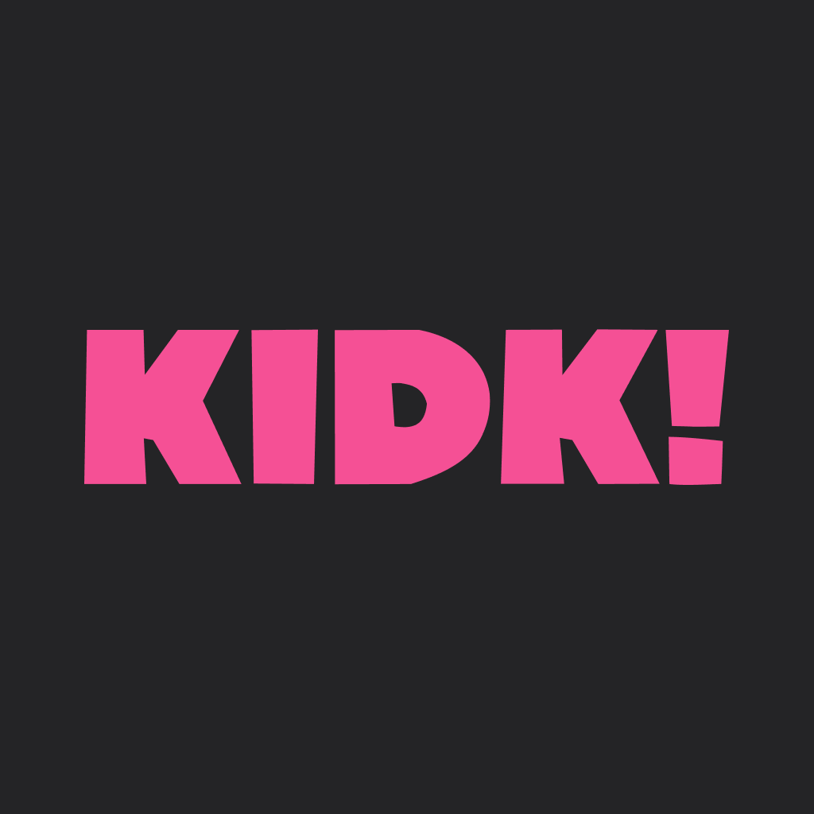
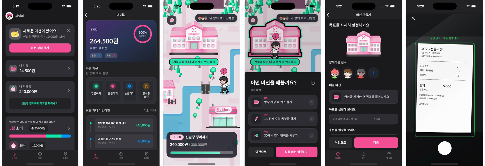

# 키득 (KIDK)

  
   
   
  <b>키득(KIDK)</b>은 게임화된 금융 학습과 부모 협업 구조를 결합한 <b>초등 금융 교육</b> iOS 앱입니다.
   
   
  Learn Money, Grow Your City.

  
  
  

  

## 프로젝트 개요

초등학교 3~6학년이 저축, 소비, 미션 수행을 통해 금융 개념을 체험할 수 있도록 돕는 앱입니다.
부모가 미션을 만들고, 자녀가 수행하면 보상금이 가상 계좌로 이체되는 협업 구조와 게임형 도시 성장 UI를 결합했습니다.
또래 문화와 SNS에서 비롯되는 모방 소비를 줄이고, 가정 안에서 경제 교육을 계속 이어갈 수 있도록 어린이와 부모를 함께 사용자로 설계했습니다.

- **핵심 기간**: 2025.04 - 2025.06
- **역할**: iOS 단독 개발
- **배포 타겟**: iOS 18.0+
- **GitHub**: [KIDK-iOS](https://github.com/piriram/KIDK-iOS)

## 문제 정의

- 어린이는 디지털 콘텐츠와 또래 문화의 영향을 강하게 받아 충동적 모방 소비를 경험하기 쉽습니다.
- 부모는 자녀 경제 교육의 필요성은 느끼지만, 실제로 어떤 방식으로 용돈과 소비 습관을 지도해야 할지 막막한 경우가 많습니다.
- KIDK는 이 문제를 `미션`, `보상`, `도시 성장`, `소비 리포트`로 연결해 경제 교육을 지식 전달이 아니라 반복 행동으로 바꾸는 데 집중했습니다.

## 서비스 설계 방향

- **게임형 경제 학습**: 키득 시티에서 미션, 레벨업, 캐릭터 성장으로 경제 개념을 경험
- **부모-자녀 협업 구조**: 부모가 미션을 승인하고 보상을 연결해 가정 내 교육 흐름을 앱 안으로 가져옴
- **시각화된 피드백**: 소비 리포트, 저축 진행도, 도시 성장 UI로 추상적인 경제 개념을 눈에 보이게 설계
- **확장 가능성**: AI 코치, 영수증 인식, NPC 챗봇 같은 개인화 기능으로 확장 가능한 구조를 구상

## 관련 문서

- `PRODUCT_OVERVIEW.md` - 서비스 배경, 리서치, 포지셔닝
- `DESIGN_AND_PROTOTYPE.md` - 게임 설계, 프로토타입 흐름, AI/확장 아이디어
- `portfolio_kidk_core_implementations.md` - 구현 기준 핵심구현 3가지
- `API_SPECIFICATION.md` - 백엔드 API 계약

## 주요 기능

- 🏙️ **키득 시티** — 레벨별로 해금되는 가상 도시에서 금융 개념 체험
- 📋 **미션 시스템** — 부모가 미션 생성, 자녀가 수행 인증, 부모가 승인
- 💰 **보상 이체** — 미션 승인 시 가상 계좌로 보상금 자동 이체
- 🤖 **온디바이스 AI 코칭** — Foundation Models로 소비 패턴 분석, 네트워크 없이 동작
- 📊 **소비 리포트** — Vision OCR 영수증 인식으로 지출 자동 분류

## 기술 스택

| 분류 | 기술 |
|------|------|
| UI / Presentation | UIKit, SnapKit, SpriteKit |
| Architecture | MVVM, Coordinator, Repository Pattern |
| Reactive & State | RxSwift |
| Data Layer | Realm, Firebase Authentication |
| Network | URLSession, RequestInterceptor |

## 핵심 구현

### 1. Firebase-백엔드 이중 인증 + Keychain 토큰 저장
Firebase 로그인 후 백엔드 JWT를 교환하는 두 인증 체계를 화면, 도메인, 네트워크 3계층으로 분리해 하나의 흐름으로 통합했다.
토큰은 `KeychainWrapper`로 저장해 UserDefaults 대비 보안 수준을 높이고, 401 발생 시 refreshToken 재발급과 강제 로그아웃까지 자동 처리했다.

`Firebase Auth` `Keychain` `JWT 교환` `RequestInterceptor`

---

### 2. REST API 인터셉터 + 응답 포맷 불일치 파싱
인증 헤더 주입과 401 재발급을 인터셉터로 공통화해 화면마다 반복하던 인증 처리를 제거했다.
백엔드 과도기 응답을 `ApiResponse<T>` 우선 디코딩 후 실패 시 직접 파싱하는 fallback 전략으로 처리해 API 1개당 개발 시간을 `2시간 → 20분`으로 줄였다.

`RequestInterceptor` `Fallback 파싱` `401 재발급` `에러 표준화`

---

### 3. 미션 상태 머신 + 도메인 이벤트 기반 멀티 화면 동기화
미션 생성부터 승인, 보상 이체까지를 유스케이스 단위 ViewModel로 분리하고, 승인 성공 시 `missionRewardCompleted` 도메인 이벤트를 발행해 미션 목록, 지갑, SpriteKit 도시 화면이 동시에 갱신되도록 설계했다.
상태 불일치 없이 부모-자녀 화면이 하나의 미션 라이프사이클을 공유한다.

`도메인 이벤트` `상태 머신` `UseCase 분리` `SpriteKit`

## 개발자

|  |
|:---:|
| [Piri(김소람)](https://github.com/piriram) |
| iOS 개발 |

## License

MIT License
